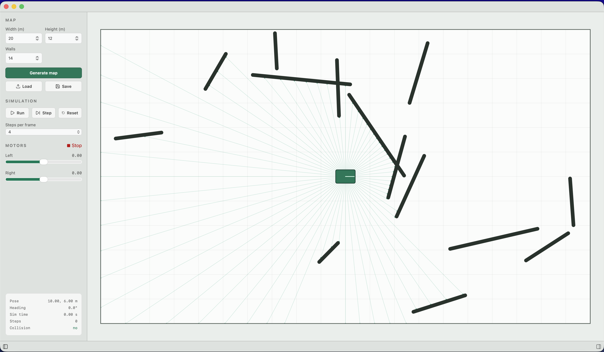

# phys-ai

> Experimenting with AI-powered robotics

A basic simulation environment for a simulated AMR (Autonomous Mobile Robot), allowing for a neural network to control the robot's behavior and learn from its simulated environment.

